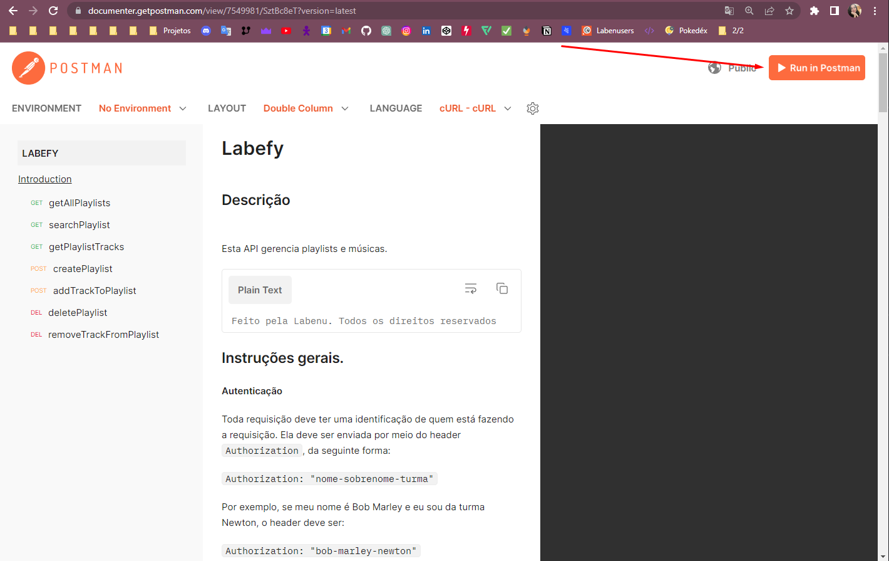
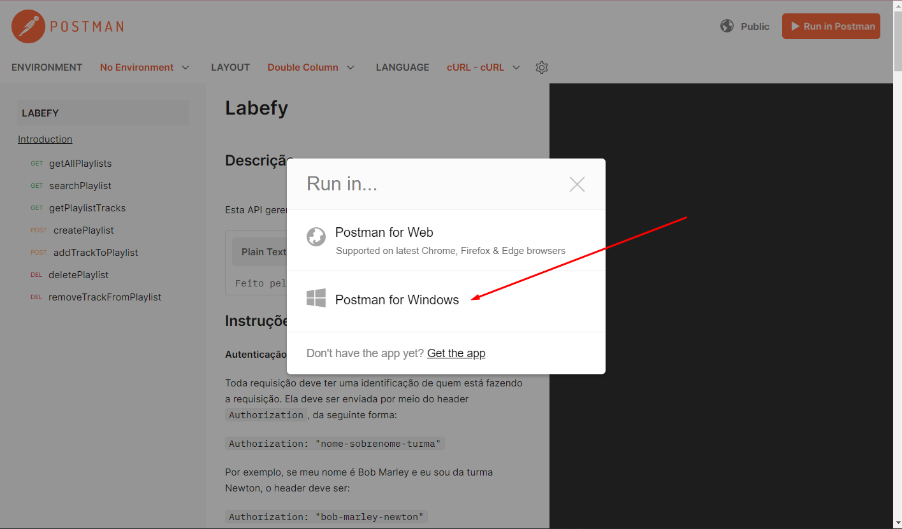
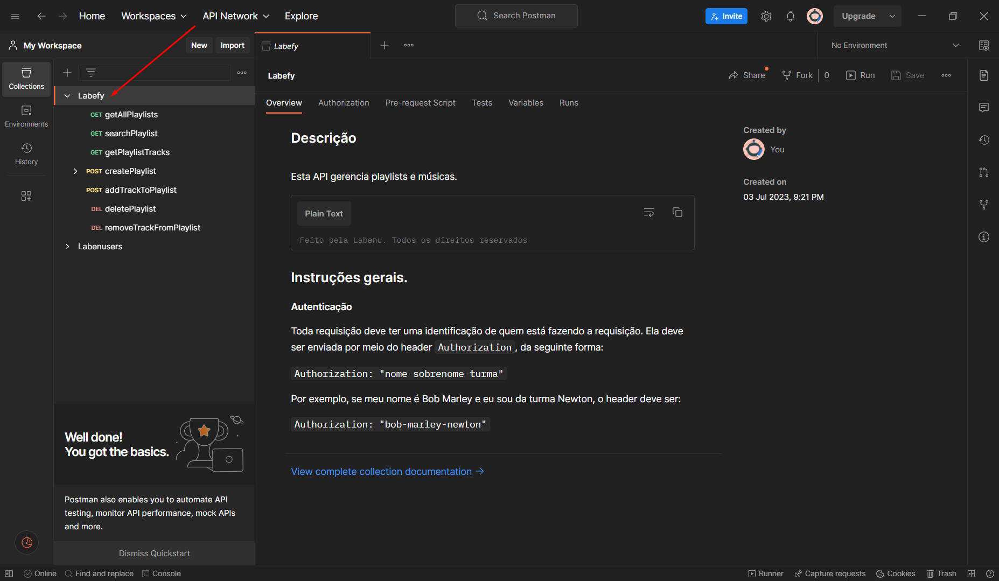
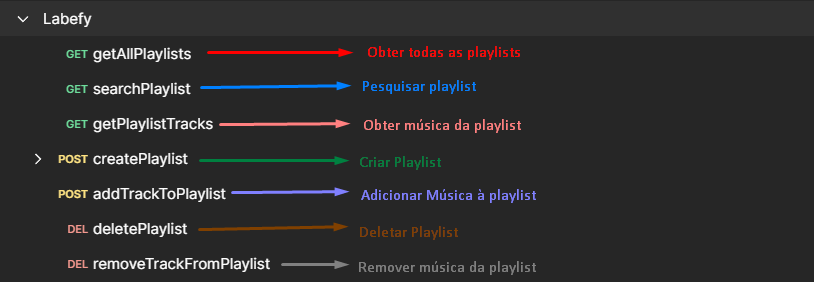

# HTTPS e Postman - Resolução

## Índice
-   [1. Resolução Exercício 1](#1-resolução-exercício-1)
-   [2. Resolução Exercício 2](#2-resolução-exercício-2)
-   [3. Resolução Exercício 3](#3-resolução-exercício-3)

### 1. Resolução Exercício 1

[✔] Leitura desse material: [link para a documentação da API](https://documenter.getpostman.com/view/7549981/SztBc8eT?version=latest)

[✔] Abrir a API no Postman com os seguintes passos:





[✔] Traduzi os métodos para facilitar a manipulação:


### 2. Resolução Exercício 2

**[✔] a) Crie três playlists:**

Em `createPlaylist` > `Headers`:

```
Authorization: "nome-sobrenome-turma"
```

Ainda em `createPlaylist`, só que agora em `Body`:

```
{
    "name": "string"
}
```

Obs: `string` é o nome da playlist

Clicando em `Send` e obtendo o resultado `200 OK`, significa que a playlist foi criada

Para criar mais duas playlist, repeti os passos anteriores mais duas vezes.

**[✔] b) Verifique se elas foram criadas corretamente.**

Para realizar a verificação utilizei o `getAllPlaylists` da seguinte forma:

-   `getAllPlaylists` > `Headers` :

```
Authorization: "nome-sobrenome-turma"
```

E obtive esse resultado:

```
{
    "result": {
        "quantity": 3,
        "list": [
            {
                "id": "61ca160b-25d0-4fad-a8f7-274055419cf5",
                "name": "playlist animada"
            },
            {
                "id": "35471f8a-2997-48eb-b1bc-746d384ed923",
                "name": "playlist estudos"
            },
            {
                "id": "0c92f366-4648-4659-89fe-b0367ae81740",
                "name": "playlist relaxar"
            }
        ]
    }
}
```

`Status: 200 OK`

**[✔] c) Adicione duas músicas em cada uma delas.**

Para adicionar as músicas nas playlists usei o `
addTrackToPlaylist` da seguinte forma:

-   Em `addTrackToPlaylist` > `Headers`:

```
Authorization: "nome-sobrenome-turma"
```

Ainda em `addTrackToPlaylist` só que agora em `Params` > `Path Variables` passei o id da playlist que eu gostaria de adicionar a música

```
playlistId: id da playlist (obrigatório)
```

Ainda em `addTrackToPlaylist` só que agora em `Body` passar os respectiovs valores:

```
{
    "name": "string",
    "artist": "string",
    "url": "string"
}
```

Onde:

-   name: nome da música (obrigatório)
-   artist: cantor ou banda da música (obrigatório)
-   url: URL da música para ser tocada (obrigatório)

Assim, repetir os processo para música que desejo adicionar a cada playlist encontrando-a pelo seu id.

**[✔] d) Verifique se as músicas foram adicionadas corretamente.**
Para isso utilizei a `getPlaylistTracks` da seguinte forma:

-   Em `getPlaylistTracks` > `Headers` :

```
Authorization: "nome-sobrenome-turma"
```

-   Ainda em `getPlaylistTracks` só que agora em `Params`:

```
playlistId: id da playlist (obrigatório)
```

Obtendo o seguinte resultado da playlista verificada:

```
{
    "result": {
        "quantity": 3,
        "tracks": [
            {
                "id": "d0fd86b4-b80e-4464-bbe0-94d09fb5f7b0",
                "name": "Happy",
                "artist": "Pharrell Williams",
                "url": "https://www.youtube.com/watch?v=ZbZSe6N_BXs&ab_channel=PharrellWilliamsVEVO"
            },
            {
                "id": "c2072c28-278e-46bf-8466-c4a945983536",
                "name": "Don't Start Now ",
                "artist": "Dua Lipa",
                "url": "https://www.youtube.com/watch?v=oygrmJFKYZY&list=PLa26d-dWyowFl4J9datdy3pxTk0ZXq-At&index=34&ab_channel=DuaLipa"
            },
            {
                "id": "fe2c0bb3-2009-42f3-bea3-2f4af332ab83",
                "name": "So What",
                "artist": "Pink",
                "url": "https://www.youtube.com/watch?v=FJfFZqTlWrQ&list=PLa26d-dWyowFl4J9datdy3pxTk0ZXq-At&index=42&ab_channel=PinkVEVO"
            }
        ]
    }
}
```

### 3. Resolução Exercício 3

---
